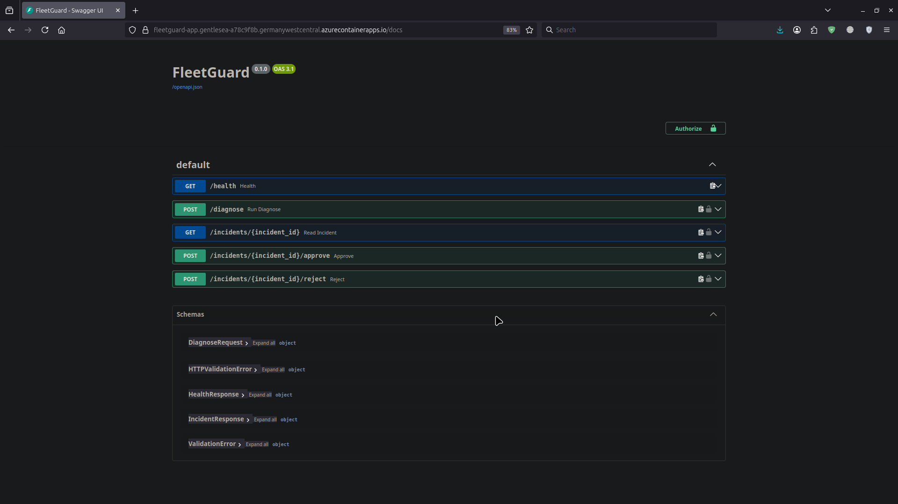
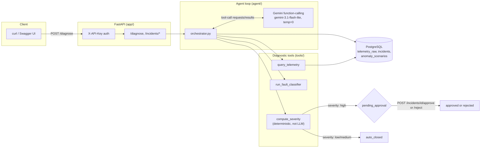
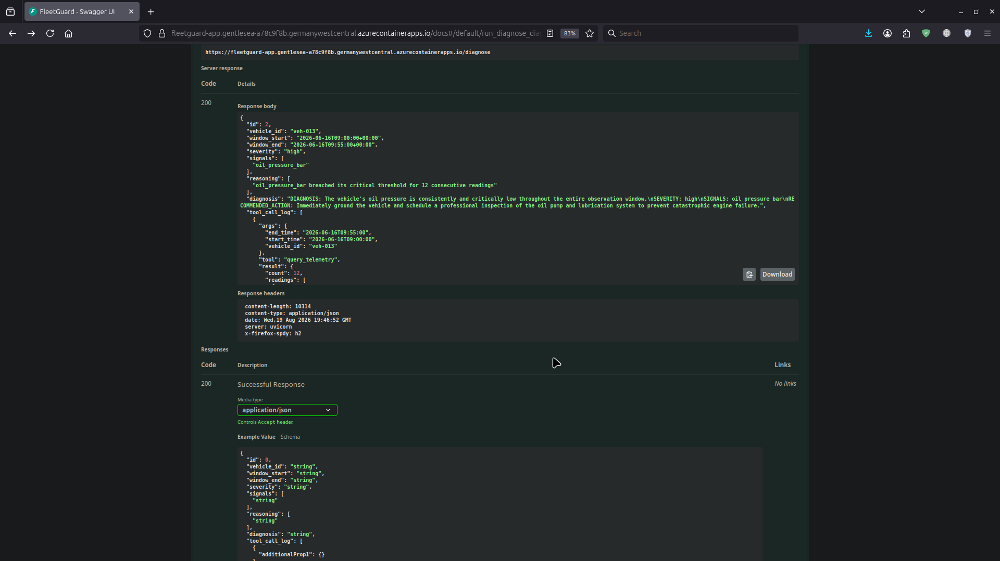

# FleetGuard

An autonomous agent that diagnoses vehicle-fleet telemetry anomalies through multi-step tool
calling, and gates any high-severity finding behind human approval before it's considered closed.



[](LICENSE)


## Table of contents

- [What it does](#what-it-does)
- [Architecture](#architecture)
- [Quick start (Docker)](#quick-start-docker)
- [Local development](#local-development)
- [Usage example](#usage-example)
- [API reference](#api-reference)
- [Running the tests](#running-the-tests)
- [Evaluation harness](#evaluation-harness)
- [Deployment](#deployment)
- [Known limitations](#known-limitations)
- [Status / roadmap](#status--roadmap)

## What it does

FleetGuard monitors synthetic multi-vehicle telemetry (engine temp, oil pressure, battery voltage,
fuel rate, hard-brake/harsh-accel events) and, on request, runs an LLM-orchestrated agent loop that:

1. **Observes** — queries the relevant telemetry window for a vehicle.
2. **Decides which tool(s) to call** — Gemini's native function-calling picks the next diagnostic
   step, not a fixed pipeline.
3. **Diagnoses** — a deterministic statistical fault classifier (rolling per-vehicle baseline,
   z-score + absolute critical thresholds + monotonic-drift detection) flags anomalous signals.
4. **Assesses severity** — a separate, non-LLM, fully deterministic function computes low/medium/
   high severity from the classifier's findings, so the gate below never depends on model output.
5. **Gates high severity behind a human** — a high-severity finding is written to Postgres as
   `pending_approval` and stays there until a person calls `POST /incidents/{id}/approve` (or
   `/reject`). Nothing high-severity auto-closes.
6. **Produces a structured incident report** — severity, implicated signals, the reasoning trail,
   and a free-text diagnosis from the model, all persisted and queryable afterward.

Detection is intentionally a deterministic statistical classifier, not a trained ML model — the
project's differentiator is the *agent orchestration* (multi-step tool calling, a real approval
gate, an evaluation harness with ground truth), not detection ML. It also keeps the evaluation
harness fully deterministic: no train/test split, no model-drift risk between runs.

## Architecture



Deployed on Azure Container Apps as two containers sharing one pod (Postgres + the FastAPI app,
talking over `localhost`) — see [Deployment](#deployment) for why, and for the two real Azure
bugs that shaped it.

## Quick start (Docker)

```bash
git clone https://github.com/Prennoy99/fleetguard.git
cd fleetguard
cp .env.example .env
# edit .env: set GEMINI_API_KEY (https://aistudio.google.com/apikey) and API_KEY (any string you choose)

docker compose up --build
```

That's it — the app container waits for Postgres, seeds the database automatically on first boot
(324,000 telemetry rows across 25 vehicles + 18 labeled anomaly scenarios), then starts serving on
`http://localhost:8000`. Confirm it's up:

```bash
curl http://localhost:8000/health
# {"status":"ok"}
```

## Local development

For running tests or scripts directly (not just via Docker):

```bash
python3 -m venv .venv
source .venv/bin/activate
pip install -r requirements-dev.txt   # pulls in requirements.txt too

# start just Postgres
docker compose up -d postgres

cp .env.example .env   # set GEMINI_API_KEY, API_KEY; DATABASE_URL defaults to localhost:5432

python -m generator.generate   # seed the DB (idempotent-ish: clears and reloads)
pytest tests/ -q
```

## Usage example

A real request against a labeled high-severity scenario (`S13`, a sustained critical oil-pressure
drop on `veh-013`):

```bash
curl -X POST http://localhost:8000/diagnose \
  -H "X-API-Key: $API_KEY" \
  -H "Content-Type: application/json" \
  -d '{
    "vehicle_id": "veh-013",
    "start_time": "2026-06-16T09:00:00",
    "end_time": "2026-06-16T09:55:00"
  }'
```

Response (trimmed):

```json
{
  "id": 2,
  "vehicle_id": "veh-013",
  "severity": "high",
  "signals": ["oil_pressure_bar"],
  "reasoning": ["oil_pressure_bar breached its critical threshold for 12 consecutive readings"],
  "diagnosis": "DIAGNOSIS: The vehicle's oil pressure is consistently and critically low...\nSEVERITY: high\nSIGNALS: oil_pressure_bar\nRECOMMENDED_ACTION: Immediately ground the vehicle and schedule a professional inspection...",
  "status": "pending_approval"
}
```



Because this is `high` severity, it stays `pending_approval` until a human resolves it:

```bash
curl -X POST http://localhost:8000/incidents/2/approve -H "X-API-Key: $API_KEY"
```

## API reference

All endpoints except `/health` require an `X-API-Key` header.

| Method | Path | Description |
|---|---|---|
| GET | `/health` | Public liveness check. |
| POST | `/diagnose` | Body: `{vehicle_id, start_time, end_time}`. Runs the full agent loop, returns the incident. |
| GET | `/incidents/{id}` | Fetch a previously created incident. 404 if missing. |
| POST | `/incidents/{id}/approve` | Resolve a `pending_approval` incident as `approved`. 409 if not pending. |
| POST | `/incidents/{id}/reject` | Resolve a `pending_approval` incident as `rejected`. 409 if not pending. |

Full interactive docs at `/docs` (Swagger UI, screenshot above).

## Running the tests

```bash
pytest tests/ -q
```

52 tests, all passing locally (unit tests per tool, stubbed-Gemini orchestrator tests, live
end-to-end orchestrator runs against the real Gemini API, and API-layer tests via FastAPI's
`TestClient`). Requires the local Postgres from `docker compose up -d postgres` to be running and
seeded.

## Evaluation harness

```bash
python -m eval.evaluate --min-hit-rate 0.8
```

Runs the real agent (live Gemini calls, no stubbing) against all 18 labeled ground-truth scenarios
and checks each diagnosis against both expected severity and expected signal attribution. Exits
nonzero if the pass rate drops below the threshold — wired into `.github/workflows/eval.yml` as a
CI gate on pushes/PRs to `main`.

**Current pass rate: 18/18 (100%), 0 forced fallbacks** — from an actual run
(`eval/results.json`), not a projected number.

## Deployment

Live on Azure Container Apps (consumption plan). Containerized via `Dockerfile`, image hosted on
GitHub Container Registry (free for a public image), deployed with `deploy/azure_deploy.sh`.

The deployed shape differs from the original design in one significant way: Postgres and the API
run as **two containers in a single pod** (a sidecar, talking over `localhost`), not as separate
container apps. That changed live, during the actual deploy, after hitting two real Azure bugs:

- Azure Files (SMB-backed) doesn't support the POSIX chmod/locking operations Postgres's `initdb`
  needs — it crash-looped forever on a permissions error and never started.
- Independently, Container Apps' internal TCP ingress didn't route traffic at all in this
  environment, confirmed by both a one-off job and the long-running API container timing out
  trying to reach an already-healthy, listening Postgres instance over its internal FQDN.

Merging Postgres into the API app's own pod sidesteps both — no ingress, no volume, containers
talk over `localhost`. The tradeoff: Postgres data lives on the container's ephemeral local
storage, so it doesn't survive a replica restart. Acceptable for a short deploy-and-demo window;
the image's own entrypoint (`docker-entrypoint.sh`) re-seeds automatically on next boot if the
database comes up empty.

No autonomous fleet-wide sweep is implemented — `POST /diagnose` is the only way a diagnosis run
starts. A scheduler calling that same endpoint per vehicle would be a straightforward way to add
one; deliberately out of scope here to keep the evaluation harness's "one labeled scenario → one
API call → one ground-truth diff" model clean.

## Known limitations

- **Statistical detector, not ML.** `run_fault_classifier` is a per-vehicle rolling z-score +
  absolute-threshold + monotonic-drift detector, not a trained model. Fully explainable and
  deterministic, but it can't learn patterns beyond what its thresholds encode.
- **False positives during activity ramps.** `engine_temp_c` and `battery_v` have real warm-up/
  charging relaxation dynamics. A window that catches a vehicle mid-transition (just started
  driving, still warming up) can look statistically identical to an injected fault. An informal
  sweep of ~140 random windows on the 7 scenario-free vehicles produced a "medium" reading on
  about a quarter of them, concentrated at morning/evening activity ramps. All 18 labeled
  scenarios sit inside stable driving periods and are unaffected — this is a deliberate scope
  tradeoff (explainable statistical detection over ML), not something chased down further.
- **Eval harness covers labeled scenarios only**, not general false-positive rate across arbitrary
  windows (see above) or concurrent-request behavior.
- **Postgres data doesn't persist across a replica restart on Azure** (see Deployment) — a
  deliberate tradeoff for a short-lived demo deployment, not something to rely on for anything
  long-running.

## Status / roadmap

Done: data generation & schema, diagnostic tools, agent orchestration, CI-gated evaluation
harness, Azure deployment (verified end-to-end: seeding, health check, full diagnose → approval
round trip against a live high-severity scenario).

Not built, listed honestly as future scope: an autonomous fleet-wide sweep (scheduler + the
existing `/diagnose` endpoint), a real ML-based fault classifier, multi-tenant auth beyond a single
shared API key.
